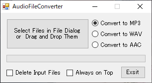

# audio_file_converter
***audio_file_converter*** is a tool to convert MP3, WAV and AAC to each other.

## Usage

### Example 1
1. Select a conversion format by clicking one of the radio buttons.
2. Select files to convert in the file dialog.

### Example 2
1. Select a conversion format by clicking one of the radio buttons.
2. Drag and Drop files or a folder onto the window screen.